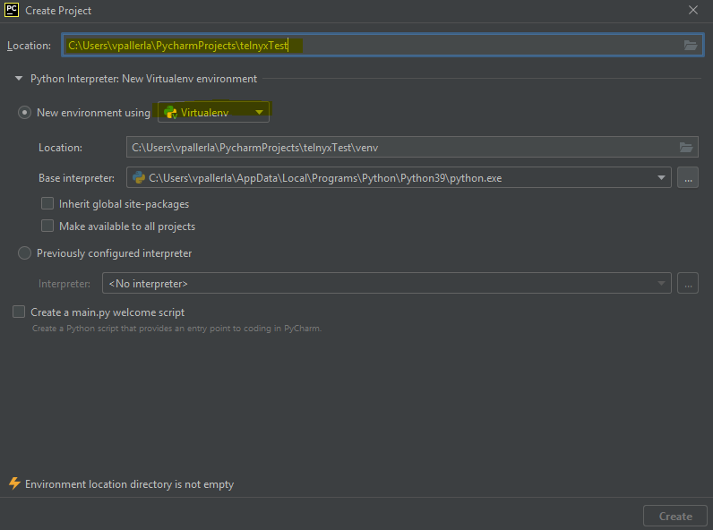
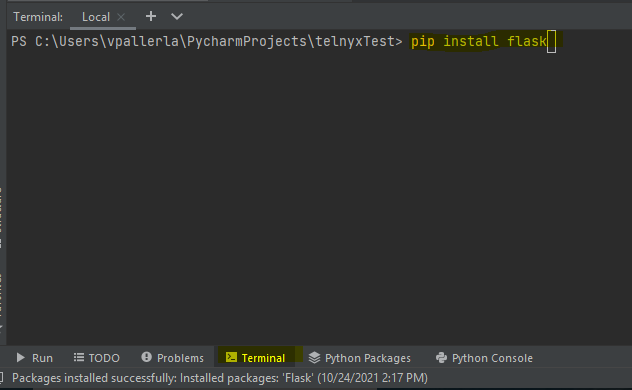
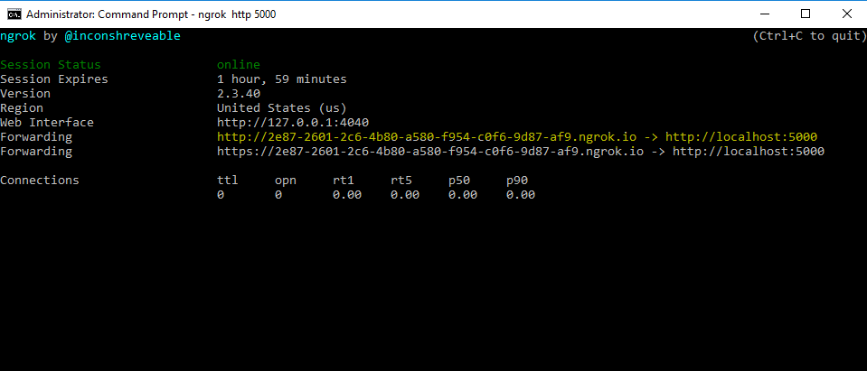
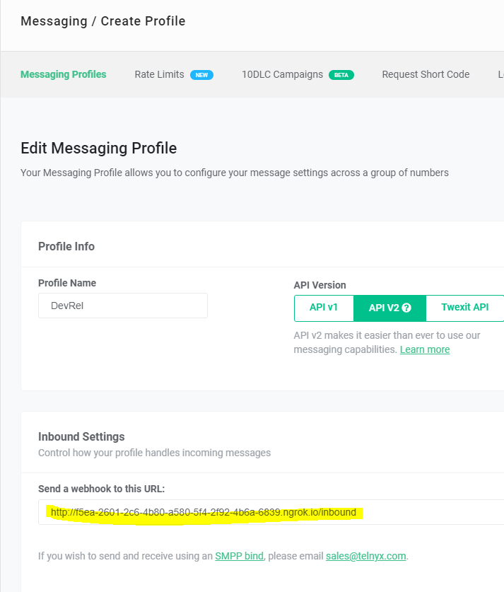
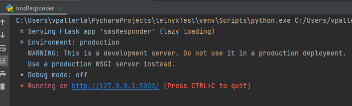

# SMS Auto-Responder Application
## _Build a SMS auto-responder With Python, Flask and Telnyx._

Sample web application demonstrating Telnyx SMS API
- Receives inbound sms message
- Checks the text of sms message
- Responds to the text based on the contents

## What does the application do?
At the end of this tutorial you'll have an application that:
- Receives an inbound message (SMS)
- Checks the message contents and responds based on following rules:

    | Incoming SMS | Response |
    | ------ | ------ |
    | pizza | Chicago pizza is the best |
    | Ice cream | I prefer gelato |
    
    _For text not matching either the options above, respond with the sentence: “Please send either the word ‘pizza’ or ‘ice cream’ for a different response”_

## Requirements 

- Python 3 and above
- pip and virtualenv to handle application dependencies
- The Flask micro web framework: We will create a web application that responds to incoming SMS messages with it.
- I used the free [PyCharm community edition](https://www.jetbrains.com/pycharm/download/) in this tutorial to satisfy above requirements with ease.
- A [Telnyx account](https://telnyx.com/sign-up) to use their SMS web API. If you are new to Telnyx, create an [account](https://telnyx.com/sign-up) now and get 10$ credit to explore Telnyx platform.
- [Ngrok](https://ngrok.com/download) for localhost tunneling to our Flask application while it's running on our local development environment.
We will use this to connect the Flask application running on your system to a public URL that Telnyx can connect to. If you don’t have ngrok installed, please download from [here](https://ngrok.com/download).

## Environment Setup

### Telnyx Portal Setup
> Our beloved Telnyx Developer Relations team did an amazing job creating awesome documentation to get started with telnyx making it easy for developers get the taste of Telnyx.

Just follow the [steps here](https://developers.telnyx.com/docs/v2/messaging/quickstarts/portal-setup) and make sure you accomplished the following:
- [x] Sign up for a free Telnyx account.
- [x] Buy an SMS-capable phone number.
- [x] Create a messaging profile to configure how you send and receive messages on your phone number.
- [x] Assign your phone number to your messaging profile.
### Development Environment Setup 

> This tutorial uses PyCharm but you can use your own existing IDE and follow similar steps accordingly.
> If you decided to use PyCharm and have not downloaded yet, please download it from [here](https://www.jetbrains.com/pycharm/download/)

In PyCharm, Create a new  Python project
```
File -> New Project 
```
This opens a Create Project pop-up window
- provide desired location (includes project name), select the virtual environment and click Create


Install dependencies one after the other by entering the following commands in Terminal tab as shown below
```py
pip install flask
pip install telnyx
```


##### Localhost Tunneling with Ngrok
Ngrok provides a localhost tunnel so that outside services can connect to a server running in your local development environment. 
- Download and install [Ngrok](https://ngrok.com/download)
- We will be using port 5000 in our application. So, we will run Ngrok locally and connect our Flask app running on port 5000.
- To do this, Within the directory where you extracted Ngrok, run this command.
```sh
./ngrok http 5000
```
- Terminal should look something like this:

- Make a note of the forwarding URL (_you will need it later_)
- At this point you can point your application to generated ngrok URL + path 
    (Example: http://{your-url}.ngrok.io/messaging/inbound).

 Add the public proxy URL(Forwarding URL) to your Inbound Settings in the Mission Control Portal. To do this, click the edit symbol ✎ next to your Messaging Profile. In the "Inbound Settings" > "Webhook URL" field, paste the forwarding address from ngrok into the Webhook URL field. Add /inbound to the end of the URL to direct the request to the webhook endpoint in your server.
 

For now you'll leave “Failover URL” blank, but if you'd like to have Telnyx resend the webhook in the case where sending to the Webhook URL fails, you can specify an alternate address in this field.

> `Note:` As ngrok session expires in 2 hours after invoking by default, if it is more than 2 hours please stop it and run again, get the new forwarding address and update it in Telnyx Mission Control Portal to avoid any issues.


##### Obtain your API key
Once you have Telnyx account setup with above instructions, it is time to obtain the API key.
You need to obtain your API key so Telnyx can authenticate your integration’s API requests
For instructions on how to obtain API key from Telnyx portal, please follow Step 1 from [here](https://developers.telnyx.com/docs/v2/messaging/quickstarts/dev-env-setup)

Create a config_file.cfg file in your project directory and the following line. Flask will load this at startup.
```sh
API_KEY='YOUR_API_KEY'
```
> Replace 'YOUR_API_KEY' with the API key you obtained in Step 1
> `Note:` As this file contains a secret key, it should not be committed to source control.

```
Checkpoint: By now, you should have accomplished these
```
- [x] Create PyCharm Project.
- [x] Install dependencies
- [x] ngrok install and run, update inbound settings in Mission Control Portal
- [x] Obtain API Key

##### Building our Flask Web App
Our Flask application will have two routes: 
>one route that handles incoming HTTP POST requests and the other to acknowledge outbound messages from Telnyx.

Create a new file named smsResponder.py at where you choose to store your Python project files.
Within the smsResponder python file, please add the following code:

_Import required dependencies, Load basic Flask application and config file we created_
```py
import telnyx
from flask import Flask, request, Response
from urllib.parse import urlunsplit

app = Flask(__name__)
app.config.from_pyfile('config_file.cfg')
```

_Add the following route to receive webhooks from Telnyx_

```py
#Read the incoming sms message and respond based on the content
@app.route('/inbound', methods=['POST'])
def inbound_message():
    body = request.json
```
Notice that the code above defines a /inbound endpoint that supports POST requests. Each time your Telnyx number receives a message from the user, it will invoke this endpoint. function inbound_message() is going to analyze the text sent by the user and provide the appropriate response based on the requirements.

> `Note:`To understand the telnyx API response and descriptions, please go through this simple [tutorial](https://developers.telnyx.com/docs/v2/messaging/message-detail-records/message-detail-records)

Then, assign required response data to variables with meaningful names to use them later in the code. 
```py
#Generate URL for outbound method defined later to confirm delivery receipt
    delivery_reporting_url = urlunsplit((
        request.scheme,
        request.host,
        "/outbound",
        "", ""))
    incoming_msg = body['data']['payload']['text']
    incoming_msg = " ".join(incoming_msg.split()).lower()
    user_number = body['data']['payload']['from']['phone_number']
    telnyx_number = body['data']['payload']['to'][0]['phone_number']
    telnyx.api_key = app.config['API_KEY']
```
Notice that inbound text is split and joined, converted to lowercase, so as to consider all the ways a user might be sending the text. 
Examples: PiZza, ice   &nbsp;  &nbsp;  &nbsp;cream, ICE Cream  etc..._

Logic and sending response back to the user:
```py
is_responded = False
    if incoming_msg == 'pizza':
        response = "Chicago pizza is the best"
        is_responded = True
    if incoming_msg == 'ice cream':
        response = "I prefer gelato"
        is_responded = True
    if not is_responded:
        response = "Please send either the word ‘pizza’ or ‘ice cream’ for a different response"
    try:
        telnyx_response = telnyx.Message.create(
            from_=telnyx_number,
            to=user_number,
            text=response,
            webhook_url=delivery_reporting_url,
            use_profile_webhooks=False
        )
        print(f"Sent message with id: {telnyx_response.id}")
    except Exception as e:
        print("You came to a forbidden area. Check the error below to find out how you can go back:")
        print(e)
    return Response(status=200)
```
In the above code, we compare the incoming text to see if it matches with "pizza" or "ice cream" and send response accordingly. Notice that when creating the response, we use the outbound webhook URL so as to get an acknowledgement once the user receives the SMS from Telnyx number.

Code for the outbound webhook can be found here:
```py
#Delivery report Confirmation
@app.route("/outbound", methods=["POST"])
def outbound_message():
    body = request.json
    message_id = body["data"]["payload"]["id"]
    print(f"Received Delivery Reporting(DLR) message with id: {message_id}")
    return Response(status=200)
```

Hooray!!! You are almost there. All you need to do now is run your application at port 5000 as follows so that incoming requests can access your application through ngrok tunnel we created before. 
```py
if __name__ == "__main__":
    app.run(port=5000)    #Using port 5000 locally to run our web application
```

##### All Together
As you have seen all the bits and pieces of the auto responder implementation so far, it is time to put all the pieces together. You can copy the code below into *smsResponder.py* file:

```py
import telnyx
from flask import Flask, request, Response
from urllib.parse import urlunsplit

app = Flask(__name__)
app.config.from_pyfile('config_file.cfg')

#Read the incoming sms message and respond based on the content
@app.route('/inbound', methods=['POST'])
def inbound_message():
    body = request.json
    #Generate URL for outbound method defined later to confirm delivery receipt
    delivery_reporting_url = urlunsplit((
        request.scheme,
        request.host,
        "/outbound",
        "", ""))
    incoming_msg = body['data']['payload']['text']
    incoming_msg = " ".join(incoming_msg.split()).lower()
    user_number = body['data']['payload']['from']['phone_number']
    telnyx_number = body['data']['payload']['to'][0]['phone_number']
    telnyx.api_key = app.config['API_KEY']
    is_responded = False
    if incoming_msg == 'pizza':
        response = "Chicago pizza is the best"
        is_responded = True
    if incoming_msg == 'ice cream':
        response = "I prefer gelato"
        is_responded = True
    if not is_responded:
        response = "Please send either the word ‘pizza’ or ‘ice cream’ for a different response"
    try:
        telnyx_response = telnyx.Message.create(
            from_=telnyx_number,
            to=user_number,
            text=response,
            webhook_url=delivery_reporting_url,
            use_profile_webhooks=False
        )
        print(f"Sent message with id: {telnyx_response.id}")
    except Exception as e:
        print("You came to a forbidden area. Check the error below to find out how you can go back:")
        print(e)
    return Response(status=200)

#Delivery report Confirmation
@app.route("/outbound", methods=["POST"])
def outbound_message():
    body = request.json
    message_id = body["data"]["payload"]["id"]
    print(f"Received Delivery Reporting(DLR) message with id: {message_id}")
    return Response(status=200)


if __name__ == "__main__":
    app.run(port=5000)    #Using port 5000 locally to run our web application
```
What are you waiting for??
Just hit the RUN button to see your application go live:
You should see something similar as below:


The app is now running on port 5000 inside your computer and ready to receiving incoming connections from internet through ngrok. As that is already setup, every time a user sends text to the Telnyx number,app will receive a request on the /inbound URL and respond based on your logic. 

Here is a demo of how your application should work:
[Telnyx Demo](https://www.loom.com/share/a832b37a0c954020a99db5b5b2494fb7)

> `Reminder:` Remember that with ngrok free version, you cannot hold on to a ngrok URL permanently, and the domain name that is assigned to you will be different every time you start the ngrok command. So, please update the URL in the Telnyx Console every time you restart ngrok.

```
Checkpoint: By now, you should have accomplished these
```
- [x] Write Code for the application
- [x] Run the application
- [x] Test the application
- [x] Feel accomplished and pat your back for developing an awesome application

You are now one step forward in your journey to becoming a Telnyx Champion, Wohooo !!!! 


#### REFERENCES:
- [Telnyx Developer Documentation](https://developers.telnyx.com/docs/v2/messaging)
- [Ngrok](https://ngrok.com/product)
- [PyCharm Community edition, Open Source](https://www.jetbrains.com/pycharm/download/)
- [Markdown Help] (https://dillinger.io/)
